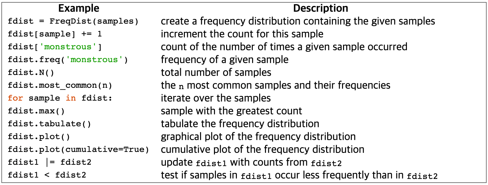
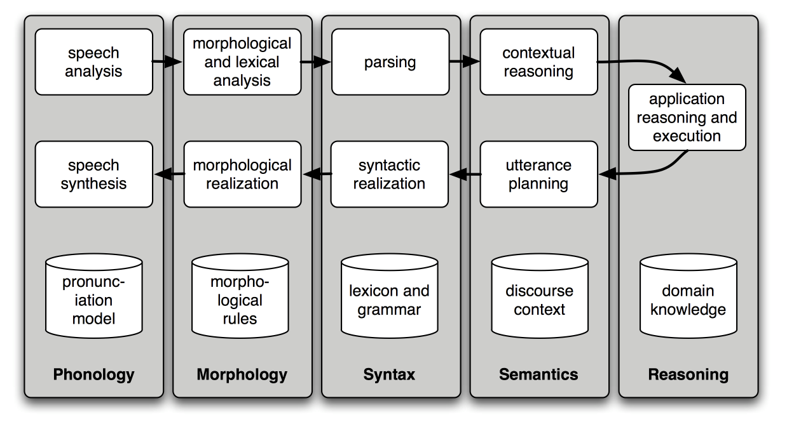

### 1.4 Counting Vocabulary

token := technical name for a sequence of characters(which we want to treat as a group)

len(text3) -> 44764     (all tokens)\
len(set(text3)) -> 2789 (distinct tokens == (word) types)

text's lexical_diversity := (# of distinct tokens) / (# of all tokens)

## 2. A Closer Look at Python: Texts as List of Words
### 2.1 Lists

text := sequence of symbols on a page. Seq\
List can be appended or added very intensively.

## 3. Computing with language: Simple Statistics
### 3.1 Frequency Distributions

NLTK built-in function FreqDist\
return [('words', '# of words'), ..] form from text\
in text1, 50 words account for nearly half of the book\
hapaxes := words that occur once only\
-> (FreqDist).hapaxes()\
in text1, 9000 words are rare words (So Many!)

### 3.2 Fine-grained Selection of words
sorted(w for w in set(text5) if len(w) > 7 and fdist5[w] > 7)\
like this phrase, we can get more fine selection of words

### 3.3 Collocations and Bigrams
Collocation := sequence of words that occur together unusually often. (red wine)\
we can get collocations by (text).collocations() built-in functions\
collocation which emerges are very specific genre of the texts

## 5. Automatic Natural Language Understanding
### 5.1 Word Sence Disambiguation

Which sence of a word was intended in a given context.\
Like "serve", "dish".

a.		The lost children were found by the searchers (agentive)\
b.		The lost children were found by the mountain (locative)\
c.		The lost children were found by the afternoon (temporal)

How can we disambiguate them?

### 5.2 Pronoun Resolution
who did what to whom := to detect the subjects and objects of verbs.

a.		The thieves stole the paintings. They were subsequently sold.\
b.		The thieves stole the paintings. They were subsequently caught.\
c.		The thieves stole the paintings. They were subsequently found.

How we can determine what is objective. \
Answering this question involves finding the antecedent(선행사) of the pronoun.\
Computational techniques for tackling this problem include anaphora(행두반복?) resolution.
- identifying what a pronoun or noun phrase refers to -

### 5.3 Generating Language Output
a.		Text: ... The thieves stole the paintings. They were subsequently sold. ...\
b.		Human: Who or what was sold?\
c.		Machine: The paintings.

How we can
1. machine's answer demonstrates that it has correctly worked out
2. machine should be able to translate the text into another Language
3. Masculine, feminine for some language.

### 5.4 Machine Translation

Eng <-> German translation to reach equlibrium\

0> how long before the next flight to Alice Springs?\
1> wie lang vor dem folgenden Flug zu Alice Springs?\
2> how long before the following flight to Alice jump?\
3> wie lang vor dem folgenden Flug zu Alice springen Sie?\
4> how long before the following flight to Alice do you jump?\
5> wie lang, bevor der folgende Flug zu Alice tun, Sie springen?\
6> how long, before the following flight to Alice does, do you jump?\
7> wie lang bevor der folgende Flug zu Alice tut, tun Sie springen?\
8> how long before the following flight to Alice does, do you jump?\
9> wie lang, bevor der folgende Flug zu Alice tut, tun Sie springen?\
10> how long, before the following flight does to Alice, do do you jump?\
11> wie lang bevor der folgende Flug zu Alice tut, Sie tun Sprung?\
12> how long before the following flight does leap to Alice, does you?

Word `Alice Springs` are not correctly translated at line 2\
before initially translated not only `vor` but also `bevor` at line 5\
given word could have several possible translations.\
Process called text alignment to automatically pair up sentences.

### 5.5 Spoken Dialog Systems
Turing Test := responding to a user's text input, perform so natually\
that we can't distinguish it from a human-generated response.

developers of commercial dialogue ststems use contextual assumptions.\
so simple rules - `When is`, `I want to know when` - gives system to provide a useful response.

architectures make simple pipeline of language understanding components.\
it parse speech input via systaticially so make representation.

### 5.6 Textual Entailment
a.		Text: David Golinkin is the editor or author of eighteen books, and over 150 responsa, articles, sermons and books\
b.		Hypothesis: Golinkin has written eighteen books

if system can determine hypothesis?\
system needs the following background knowledge for make answer.\
it is very hard to come up with automated methods for making the right decision.
