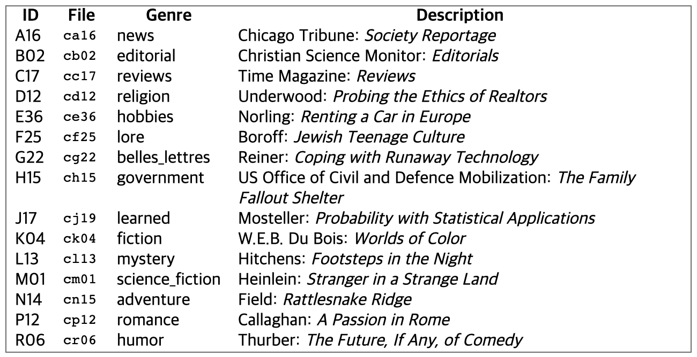
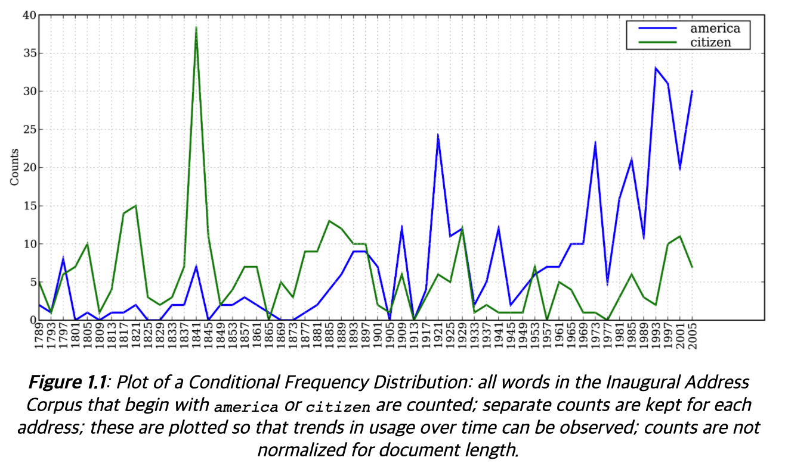
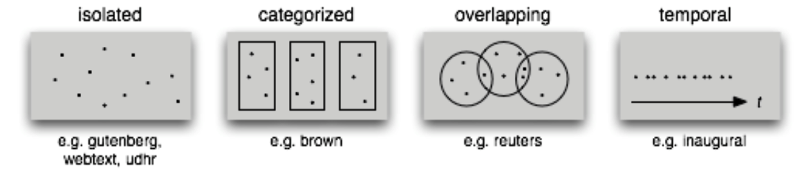
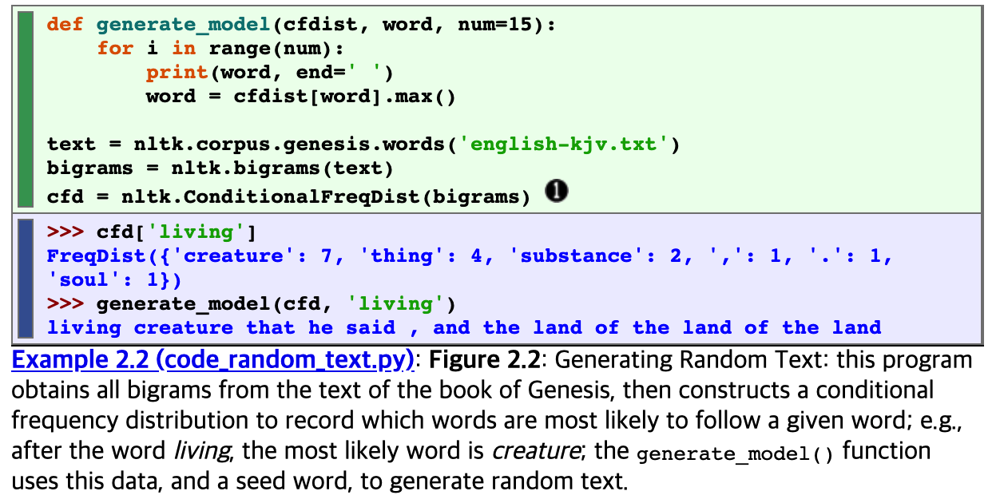

## 1. Accessing Text Corpora

### 1.1 GutenBerg Corpus
gutenberg project := 25000 text book archive \
nltk.corpus.gutenberg.fileids() <- why not field????? \
raw() -> all letters in the text \
sents() -> all sentence in the text \

### 1.2 Web and Chat Text
NLTK has small collection of web text. \
Web forum, conversations, movie script, etc \
* Instant messaging chat sessions also exist \

### 1.3 Brown corpus

Brown Corpus was the first million-word electronic corpus of Eng.\
It contains text from 500 sources, categorized by genre. \
Brown Corpus is convenient resource for studying systematic diff btw genres. \

### 1.4 Reuters Corpus 
10,788 news documents totaling 1.3m words \
classified into 90 topics, grouped into two sets `training`, `test` \
Unlike Brown corpus, categories in the Reuters corpus overlap with each other \

### 1.5 Inaugural Address Corpus(대선 연설)
Collection of 55 texts, one each presidential address. \
It has time demension. Year of each text appears in its filename \

### 1.8 Text Corpus Structure

Occasionally, text collections have temporal structure. \
Above categories are most common example.\

## 2. Conditional Frequency Distributions
### 2.3 Plotting and Tabulating Distributions

ConditionalFreqDist = Important!\

languages = ['Chickasaw', 'English', 'German_Deutsch', 'Greenlandic_Inuktikut', 'Hungarian_Magyar', 'Ibibio_Efik']\
cfd = nltk.ConditionalFreqDist(\
            (lang, len(word)) [1]\
            for lang in languages\
            for word in udhr.words(lang + '-Latin1'))\
cfd.tabulate(conditions=['English', 'German_Deutsch'], samples=range(10), cumulative=True)\

result ->
                  0    1    2    3    4    5    6    7    8    9\
       English    0  185  525  883  997 1166 1283 1440 1558 1638\
German_Deutsch    0  171  263  614  717  894 1013 1110 1213 1275\

We can see word's length in udhr text for each Eng, Ger.\
'-Latin1' postfix added to open latin decoded file.\
Conditions variable was used to select whatever we wanna see.\

### 2.4 Generating Random Text With Bigrams
bigrams() function takes a list of words and builds a list of consecutive(연속되는) word pairs\

this is how to make random text hmm...\
I think it is just collection of words which has strong consecutive...\
Not a text in real.\